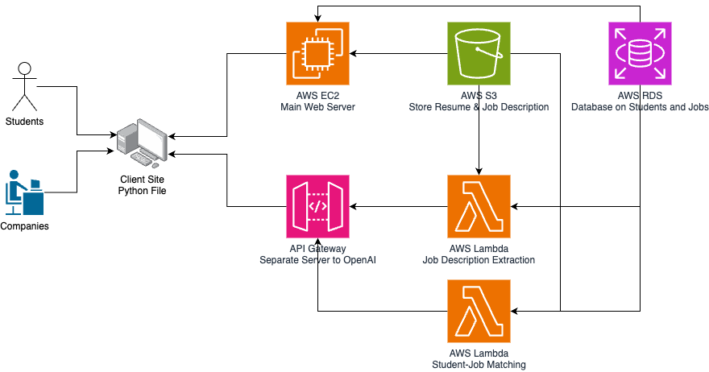
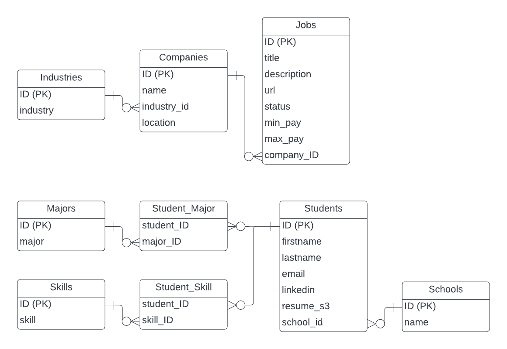

# JobSearch-Cloudbased

Our project is a full-stack software app comprising both client-side (Python) and server-side (JavaScript & Python) components. Our app is a professional job search platform that integrates various functionalities for managing user profiles, job postings, and company information. Moreover, we integrate LLM (OpenAi) to enhance job search experience and job fit. The AWS services we used include RDS, S3, Lambda, API Gateway, and EC2. 

Here are some of the main features of our app.
- **Comprehensive User Profile Management**: Students can manage academic and personal profiles, including majors and skills, which are crucial for tailored job matches. 
- **Dynamic Job Posting and Company Profiles**: Employers can post or close job listings and manage company profiles.
- **Resume Handling and Storage**: Integration with AWS S3 allows for efficient storage and retrieval of students’ resumes and job description text files, essential for job applications and searching.
- **Advanced Matching Capabilities**: LLM integration facilitates complex matching capabilities between students and jobs based on multiple criteria such as the fit between job description and student resume, which enhances the entire user experience and platform’s core functionality.


## Architecture

**Client Side**: The client side will be a Python command-line interface (similar to Projects 1 and 2). In this case, both companies and students can access the Python file. The client is connected to two endpoints: the EC2 Beanstalk web server endpoint and the API Gateway endpoint.

**AWS EC2**: Host Java Script codes for the web server (mainly I/O operations with S3 and RDS).

**AWS API Gateway**: Contains API routing logic from lambda functions (heavy computations)

**AWS Lambda**: Two functions calling OpenAI API to use LLM for heavy computations (extract keywords from job descriptions and calculate matching scores between students and job descriptions).

**AWS S3**: Store resume (pdf files) and job descriptions (txt files) – files that are hard to store in a relational database.

**AWS RDS**: Store information about students, jobs, and other additional data (such as skills and companies).

## Database Diagram

The database contains two main components: employers and students

**Employers**: The employers' side consisted of jobs, companies, and industries. 

**Students**: The students’ side consisted of students, schools, majors, and skills. Since one student can have multiple skills and majors, we also need to implement the student_major and student_skill tables as well. 

In `create_database.sql`, the team has also imposed some constraints on the primary key, foreign key, and unique to the appropriate columns.


## Project Structure
```
project_root/
├── app/
│   ├── api_assets.js
│   ├── api_company.js
│   ├── api_industry.js
│   ├── api_jd.js
│   ├── api_job.js
│   ├── api_major.js
│   ├── api_resume.js
│   ├── api_school.js
│   ├── api_skill.js
│   ├── api_status.js
│   ├── api_stats.js
│   ├── api_student.js
│   ├── aws.js
│   ├── app.js
│   └── config.js
│   └── database.js
├── client/
│   ├── client_employer.py
│   ├── client_functions.py
│   ├── client_student.py
│   └── main.py
├── database/
│   ├── create_access.sql
│   ├── create_database.sql
│   └── insert_rows.sql
└── lambda_functions/
    ├── jd_extract/
    │   ├── lambda_function.py
    │   ├── datatier.py
    │   └── config.ini
    └── student_job_matching/
        ├── lambda_function.py
        ├── datatier.py
        └── config.ini
```


## app folder (JavaScript Code)
index.js
config.js
aws.js
database.js

#### GET APIs
- api_assets.js: Return all the job related information from job/company/industry tables
    
    jobId, jobTitle, jobUrl, minPay, maxPay, companyName, industry, companyLocation

- api_users.js: 
- api_stats.js

#### PUT APIs
- api_company.js
- api_industry.js
- api_major.js
- api_school.js
- api_skill.js

#### POST APIs
- api_job.js


## client folder

#### Functions
- client_functions.py: general functions and calls to Lambda functions
- client_employer.py: 
- client_student.py: 

#### App file
- main.py


## lambda_function folder

#### jd_extract
- **Description**: This subdirectory is responsible for extracting key information from job descriptions, including:
    - Whether the job offers sponsorship.
    - Whether the job requires security clearance.
    - Skill requirements.
    - Number of years of working experience required.
    - Education background requirements.

#### student_job_matching
- **Description**: This subdirectory focuses on matching students (job seekers) with job opportunities and provides insights into:
    - The matching score between the student and the job.
    - The strengths of the candidate.
    - Areas of improvement needed by the candidate for the job.


## database folder

- create_access.sql: Sets up user access privileges for the `jobsearch` database.

- create_database.sql: Initializes the `jobsearch` database and creates necessary tables.

- insert_rows.sql: Populates the `jobsearch` database with initial data.


